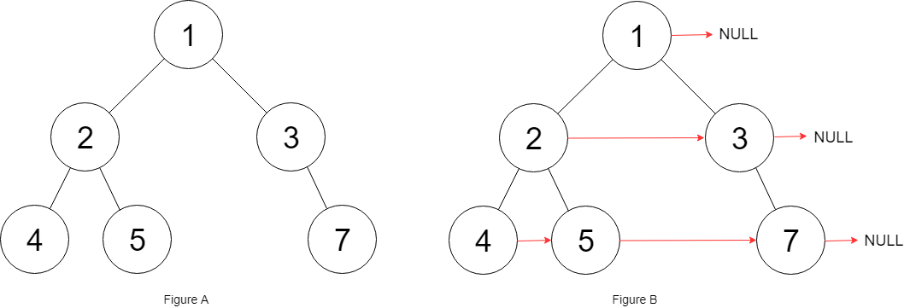

# 填充每个节点的下一个右侧节点指针II

## 问题

::: info
该问题为力扣上的[117.填充每个节点的下一个右侧节点指针II](https://leetcode.cn/problems/populating-next-right-pointers-in-each-node-ii/description/)
:::

### 描述

给定一个二叉树：

```c
struct Node {
  int val;
  Node *left;
  Node *right;
  Node *next;
}
```

填充它的每个 next 指针，让这个指针指向其下一个右侧节点。如果找不到下一个右侧节点，则将 next 指针设置为`NULL`。

初始状态下，所有 next 指针都被设置为`NULL`。

### 输入约束

- 树中的节点数在范围`[0, 6000]`内
- `-100 <= Node.val <= 100`

### 示例

#### 示例 1



> **输入：**root = [1,2,3,4,5,null,7]
>
> **输出：**[1,#,2,3,#,4,5,7,#]
>
> **解释：**给定二叉树如图 A 所示，你的函数应该填充它的每个 next 指针，以指向其下一个右侧节点，如图 B 所示。序列化输出按层序遍历顺序（由 next 指针连接），'#' 表示每层的末尾。

#### 示例 2

> **输入：**root = []
>
> **输出：**[]

## 题解

> ***O(N)时间复杂度，O(1)空间复杂度，高可读性。***

感觉官解的代码可读性不够高，且引入了全局状态。这里给出一个可读性较高的且不引入全局状态的解法。

### 思路

逐层处理。当一层处理完时，这一层可以视为一个链表。当处理第$k$层时，第$k-1$层已经处理完了，即第$k-1$层中的所有节点的$next$都指向其同层的下一个兄弟节点。因此只需要从左到右遍历第$k-1$层并依次将该层的节点的子节点从左到右相连即可。

### 代码说明

`parentLevelHead`表示上一层链表的头节点。

`nextLevelHead`表示下一层链表的头节点。

`connectNextLevel`方法接收一个表示上一层链表的头节点的参数，并构建下一层链表，返回构建完成的下一层链表的头节点。

### 复杂度

- 时间复杂度: $O(N)$
- 空间复杂度: $O(1)$

### 代码

```java
/*
// Definition for a Node.
class Node {
    public int val;
    public Node left;
    public Node right;
    public Node next;

    public Node() {}
    
    public Node(int _val) {
        val = _val;
    }

    public Node(int _val, Node _left, Node _right, Node _next) {
        val = _val;
        left = _left;
        right = _right;
        next = _next;
    }
};
*/

class Solution {

    public Node connect(Node root) {
        if (root == null) return root;
        Node parentLevelHead = root;
        Node nextLevelHead = connectNextLevel(parentLevelHead);
        while (nextLevelHead != null) {
            parentLevelHead = nextLevelHead;
            nextLevelHead = connectNextLevel(parentLevelHead);
        }
        return root;
    }

    public Node connectNextLevel(Node parentLevelHead) {
        Node dummy = new Node();
        Node cur = dummy;
        Node parent = parentLevelHead;
        while (parent != null) {
            if (parent.left != null) {
                cur.next = parent.left;
                cur = cur.next;
            }
            if (parent.right != null) {
                cur.next = parent.right;
                cur = cur.next;
            }
            parent = parent.next;
        }
        return dummy.next;
    }
}
```